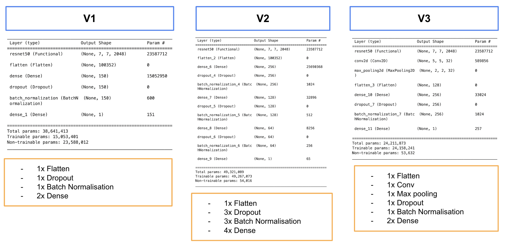
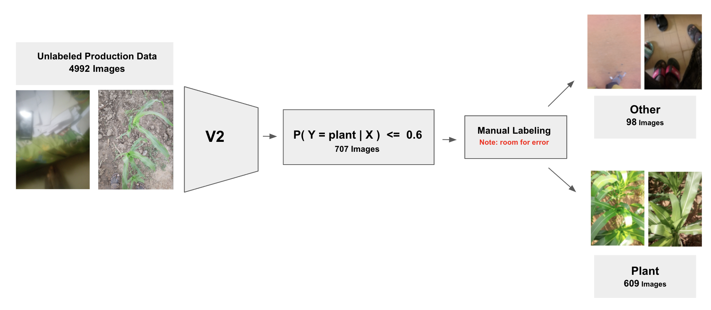
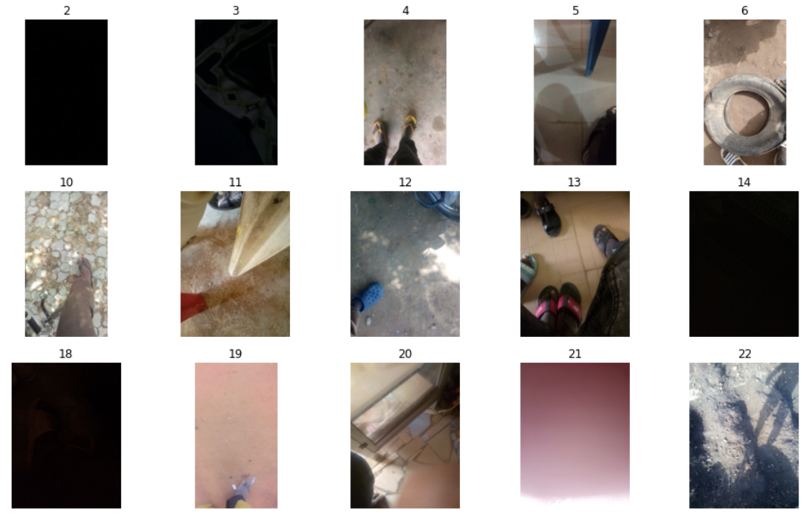

<div align="center">
  <h1>Plant classifier to identify out of distribution images</h1>
</div>

## Overiew of the problem

<div align="center"><div style="background-color: lightgrey; padding: 5px;"><strong>Big Picture Idea</strong></div></div>
<div align="center"><div style="background-color: lightgrey; padding: 5px;">Alert farmer that they should retake the image.</div></div>
<br>

<div align="center"><div style="background-color: lightgrey; padding: 5px;"><strong>Goal of This Project</strong></div></div>
<div align="center"><div style="background-color: lightgrey; padding: 5px;">Train a classifier to identify out-of-distribution images.</div></div>
<br>

<div align="center"><div style="background-color: lightgrey; padding: 5px;"><strong>Motivation</strong></div></div>
<div align="center"><div style="background-color: lightgrey; padding: 5px;">Improve the performance of all deployed models.</div></div>
<br>

During the exploratory analysis of the production data, it was observed that the presence of non-plant images was affecting the quality of the data and subsequently reducing the accuracy of the deployed models. To address this issue, a classifier was developed and trained with the aim of filtering out unsatisfactory images and ensuring that only high-quality images are fed into the models. The primary objective is to create a system that alerts farmers to retake an image if it is classified as out-of-distribution.


## Modeling Pipeline

The development of an accurate plant classifier involved the following steps:


1. **Experiment with Three Different Architectures:** Three different architectures were explored, each utilizing the ResNet50 model as the backbone. These architectures introduced variations in terms of the number of dense layers, the inclusion of batch normalization and dropout, and the utilization of convolutional layers with max pooling. The objective was to identify the most suitable approach for the task of image classification using ResNet50 as the backbone.
2. **Training the Models:** The models were trained using a combination of imagenet data, which represented the "other" class, and plant images from the production data that had labels. 
3. **Evaluation of Model Performance:** The performance of each trained model was evaluated using metrics such as loss (binary cross entropy), accuracy, and F1 score. 
4. **Selection of the Best Model:** Based on the evaluation results, the model that exhibited the best performance in terms of loss, accuracy, and F1 score was selected as the best model for further refinement.
5. **Fine-Tuning on Non-Plant Images:** The selected best model was further fine-tuned using a dataset comprised of images from the production data that were identified as non-plant images. 


The modeling pipeline can be visualized as follows:

## Experimented with different architectures to find best

Three different architectures were explored, all utilizing the ResNet50 model as the backbone.Each model introduces variations in terms of the number of dense layers, the inclusion of batch normalization and dropout, and the utilization of convolutional layers with max pooling. By exploring these different architectures, the aim is to identify the most suitable approach for the given task of image classification using ResNet50 as the backbone. Below is a brief description of each model.

<div style="display: flex; justify-content: space-between;">
  <div style="background-color: lightgrey; padding: 10px; width: 30%;display: inline-block; color: black;">
    <h2>Model 1 (V1)</h2>
    <p><strong>Architecture:</strong> This model consists of a single dense layer with 150 nodes along with a final classification layer.</p>
    <p><strong>Techniques for avoiding overfitting:</strong> Batch normalization and dropout are applied to prevent overfitting, ensuring better generalization.</p>
  </div>
  <div style="background-color:lightgrey; padding: 10px; width: 30%;display: inline-block; color: black;">
    <h2>Model 2 (V2)</h2>
    <p><strong>Architecture:</strong> This model is more complex, comprising a total of four dense layers, including the final classification layers, built on the ResNet50 backbone.</p>
    <p><strong>Techniques for avoiding overfitting:</strong> Similar to Model 1, batch normalization is employed to improve the generalisation.</p>
  </div>
  <div style="background-color: lightgrey; padding: 10px; width: 30%;display: inline-block; color: black;">
    <h2>Model 3 (V3)</h2>
    <p><strong>Architecture:</strong> In this model, a combination of convolutional layers and max pooling is added along with a dense layer on top of the ResNet50 backbone.</p>
    <p><strong>Convolutional layers and max pooling:</strong> These layers allow the model to extract spatial features from the input data effectively.</p>
  </div>
</div>

<br>



## Training the Models
TODO: describe which dataset was used (i.e imagenet)

We employed the Imagenet dataset to represent the "other" class, while utilizing labeled production data for the "plant" class. The choice of Imagenet stemmed from time constraints, as we lacked the capacity to individually examine over 300,000 unlabeled images to identify non-plant ones. Consequently, we opted to employ the best-performing model to identify these images and manually review them later. By doing so, we can extract non-plant images, which are subsequently used to fine-tune the top model. This process takes place in step 5.

## Evaluation of Model Performance and selection of the Best Model

The performance of each model was evaluated based on loss (binary cross entropy), accuracy and F1 score. Model 2 showed the best performance of all three models with a loss, accuracy and F1 score of 0.431, 0.925 and  0.953 respectively. Consequently, we proceeded with Model 2. 

| **Metrics \ Models** | **V1** | <span style="color:orange">**V2**</span> | **V3** |
|:--------------------:|:------:|:------:|:------:|
| **Loss**             | 0.435  | <span style="color:orange">0.431</span>  | 0.443  |
| **Accuracy**         | 0.918  | <span style="color:orange">0.925</span>  | 0.924  |
| **F1 Score**         |  0.949 | <span style="color:orange">0.953</span>  | 0.952  |

## Finetuning Best Performance Model on Non-Plant Images from the production data

Note: add that we did all this for all models but model 2 still peformed the best


The provided production data consists of more than 400,000 images, but only a certain number of labels were provided. We filtered out the images that did not have labels and used the previously trained classifier (Model 2) to identify which images without labels were not of plants. We fed the images without labels into the classifier and retained all images with a probability of being classified as a plant between 0 and 0.6. Note that the classifier's output is the probability of an image being a plant (p(x = plant)).Next, we manually reviewed all of the retained images and extracted the images that were of something other than plants. We used those images to fine-tune the classifier.

In summary the following steps were taken: 

1. Extract images from the production dataset that do not have labels.
2. Select a random sample of 5000 images without labels from the extracted images.
3. Use a pre-trained image classifier to predict the probability of each image belonging to a plant class.
4. Keep the images with a probability less than or equal to 0.6 of belonging to a plant class.
5. Visualize the selected images and manually verify which ones are non-plants.
6. Create a new dataset with the verified non-plant images and fine-tune the pre-trained model.


In the below pictures steps 2 -6 are visualised: 




Below are example of images manually labeled as other in step 5



In step 6, we use a weighted loss function movited by the fact that rather the farmer retake image, than feed low-quality uncertain image downstream

```python
    def weighted_loss_fn(y_true, y_pred):
        bce_loss = tf.keras.losses.binary_crossentropy(y_true, y_pred)
        weight_matrix = tf.cast(tf.greater(y_true, y_pred), tf.float32) * 2.0 + 1.0
        weighted_bce_loss = bce_loss * weight_matrix
        return weighted_bce_loss
```

### Performance

