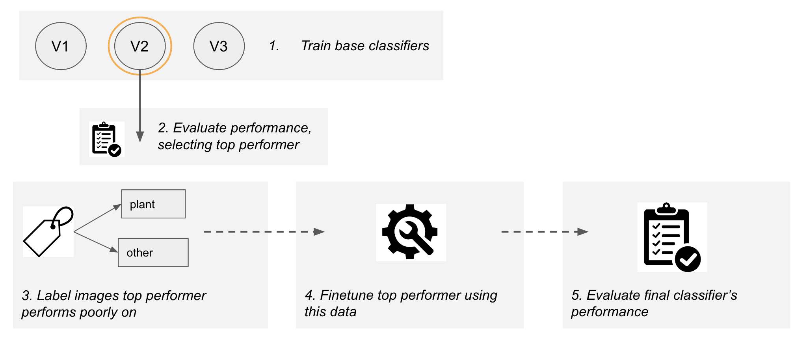

# Plant Classifier to identify out of distribution images

<strong>Big Picture Idea</strong>

Alert farmer that they should retake the image.

 

<strong>Goal of This Project</strong>

Train a classifier to identify out-of-distribution images.

 

<strong>Motivation</strong>

Improve the performance of all deployed models.

 

## Overview of the pipline

### Experimented with different architectures to find best

Three different architectures were explored, all utilizing the ResNet50 model as the backbone .Each model introduces variations in terms of the number of dense layers, the inclusion of batch normalization and dropout, and the utilization of convolutional layers with max pooling. 

1. Model 1:
- Architecture: This model consists of a single dense layer with 150 nodes along with a final classification layer.
- Techniques for avoiding overfitting: Batch normalization and dropout are applied to prevent overfitting, ensuring better generalization.

2. Model 2:

- Architecture: This model is more complex, comprising a total of four dense layers, including the final classification layers, built on the ResNet50 backbone.
- Techniques for avoiding overfitting: Similar to Model 1, batch normalization is employed to improve the generalisation.

3. Model 3:

- Architecture: In this model, a combination of convolutional layers and max pooling is added along with a dense layer on top of the ResNet50 backbone.
- Convolutional layers and max pooling: These layers allow the model to extract spatial features from the input data effectively.

By exploring these different architectures, the aim is to identify the most suitable approach for the given task of image classification using ResNet50 as the backbone. 