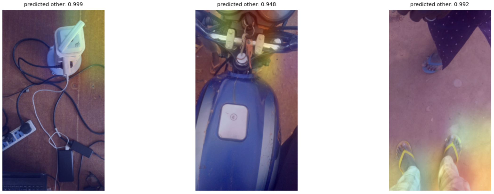
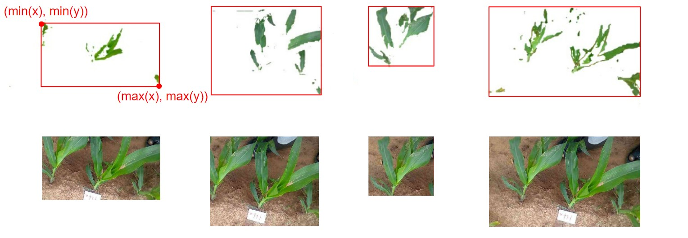

<!-- <!DOCTYPE html>
  <html>
    <head>
      <link rel="stylesheet" type="text/css" href="style.css">
    </head>
  <body> -->

<section id="Introduction-section">
</section>

# Introduction

In this project our team collaborated with Babban Gona team to create a two-part solution. Firstly, we developed a classifier that serves as a preliminary stage for all computer vision models. Secondly, we tackled the challenge of soil health assessment by implementing semantic segmentation and object detection techniques. 

<br>
<div style="text-align:center; border: 2px solid #4285f4; padding: 10px;">
  <h2>Out of Distribution Classifier</h2>
  <p>In the exploration of production data, it was discovered that the presence of non-plant images was adversely affecting data quality and reducing the accuracy of deployed models. To address this issue, a classifier was developed to filter out unsatisfactory images and ensure that only high-quality images are used for modeling. The main objective was to create a model that alerts farmers to retake images classified as out-of-distribution. The development process involved experimenting with three different architectures, all utilizing a ResNet50 backbone. The training process involved a combination of the imagenet dataset, representing the "other" class, and labeled plant images from the production data. Performance evaluation was conducted using metrics such as loss (binary cross entropy), accuracy, and F1 score. After this initial training, the models underwent further refinement. To enhance the models' performance, a fine-tuning process was employed using images the models' performed poorly on. This iterative approach aimed to specialize the model's performance to the production data and optimize its ability to accurately determine whether an image contains a plant, or not. 
</p>
</div>

<br>
<div style="text-align:center; border: 2px solid #4285f4; padding: 10px;">
  <h2>Plant Health Assesment</h2>
  <p>The objective of this part of project was to differentiate plant regions from soil and categorize plants as yellow, purple, or best practice. The Babban Gona team had previously developed an object detection model with 80% accuracy on laboratory data, but encountered difficulties when applied to production data due to the lack of labeled production data.To address this challenge, an unsupervised segmentation algorithm was utilized, employing a CNN for feature extraction and clustering, and training the CNN on loss based on the closeness of features and spatial continuity. An algorithm was then employed to mask out labels that were not plant-based based on their RGB color and green color percentage. Finally, individual plant images were input into a trained ResNet-50 for soil health classification. The proposed approach was benchmarked against the Yolov5 method used by the Babban Gona team to evaluate its performance on noisy production data. 
</p>
</div>

<br>


<section id="plant-classification-section">
</section>

# Out of Distribution Classifier 

## Overiew of the problem

<div align="center"><div style="background-color: lightgrey; padding: 5px;"><strong>Big Picture Idea</strong></div></div>
<div align="center"><div style="background-color: lightgrey; padding: 5px;">Alert farmer that they should retake the image.</div></div>
<br>

<div align="center"><div style="background-color: lightgrey; padding: 5px;"><strong>Goal of This Project</strong></div></div>
<div align="center"><div style="background-color: lightgrey; padding: 5px;">Train a classifier to identify out-of-distribution images.</div></div>
<br>

<div align="center"><div style="background-color: lightgrey; padding: 5px;"><strong>Motivation</strong></div></div>
<div align="center"><div style="background-color: lightgrey; padding: 5px;">Improve the performance of all deployed models.</div></div>
<br>

During the exploratory analysis of the production data, it was observed that the presence of non-plant images was affecting the quality of the data and subsequently reducing the accuracy of the deployed models. To address this issue, a classifier was developed and trained with the aim of filtering out unsatisfactory images and ensuring that only high-quality images are fed into the models. The primary objective is to create a system that alerts farmers to retake an image if it is classified as out-of-distribution.


## Modeling Pipeline

The development of an accurate plant-other classifier involved the following steps:


1. **Experiment with Three Different Architectures:** Three different architectures were explored, each utilizing the ResNet50 model as the backbone. These architectures introduced variations in terms of the number of dense layers, the inclusion of batch normalization and dropout, and the utilization of convolutional layers with max pooling. The objective was to identify the most suitable approach for the task of image classification using ResNet50 as the backbone.
2. **Training the Models:** The models were trained using a combination of imagenet data, which represented the "other" class, and plant images from the production data that had labels. 
3. **Evaluation of Model Performance:** The performance of each trained model was evaluated using metrics such as loss (binary cross entropy), accuracy, and F1 score.
4. **Fine-Tuning on Non-Plant Images:** The models underwent fine-tuning using a dataset comprised of images from the production data that were identified as non-plant images. 
5. **Evaluation of Model Performance:** The performance of each fine-tuned model was evaluated using the same metrics  as before. 
6. **Fine-Tuning on Dirt-Plant Images:** The models underwent fine-tuning using a dataset comprised of images of dirt for the "other" class and images of plants for the "plant" class, in order to correct for a mis-classification weakness of the models.
7. **Evaluation of Model Performance:** The final evaluation of each models' performance was analyzed using the same metrics as before. 
<div style="text-align:center;">
  
  <figcaption>The pipeline used for data preprocessing and model training.</figcaption>
</div>

## Experimented with different architectures to find best

<div style="border: 2px solid #4285f4; padding: 10px; text-align:center;">
  <p> The binary classifier takes the form of P(x = Plant).</p>
</div>

Three different architectures were explored, all utilizing the ResNet50 model as the backbone.Each model introduces variations in terms of the number of dense layers, the inclusion of batch normalization and dropout, and the utilization of convolutional layers with max pooling. By exploring these different architectures, the aim is to identify the most suitable approach for the given task of image classification using ResNet50 as the backbone. Below is a brief description of each model.

<div style="display: flex; justify-content: space-between;">
  <div style="background-color: lightgrey; padding: 10px; width: 30%; display: inline-block; color: black; text-align: center;">
    <h2>Model 1 (V1)</h2>
    <p><strong>Architecture:</strong> This model consists of a single dense layer with 150 nodes along with a final classification layer.</p>
    <p><strong>Techniques for avoiding overfitting:</strong> Batch normalization and dropout are applied to prevent overfitting, ensuring better generalization.</p>
  </div>
  <div style="background-color:lightgrey; padding: 10px; width: 30%; display: inline-block; color: black; text-align: center;">
    <h2>Model 2 (V2)</h2>
    <p><strong>Architecture:</strong> This model is more complex, comprising a total of four dense layers, including the final classification layers, built on the ResNet50 backbone.</p>
    <p><strong>Techniques for avoiding overfitting:</strong> Similar to Model 1, batch normalization is employed to improve generalisation.</p>
  </div>
  <div style="background-color: lightgrey; padding: 10px; width: 30%; display: inline-block; color: black; text-align: center;">
    <h2>Model 3 (V3)</h2>
    <p><strong>Architecture:</strong> In this model, a combination of convolutional layers and max pooling is added along with a dense layer on top of the ResNet50 backbone.</p>
    <p><strong>Convolutional layers and max pooling:</strong> These layers allow the model to extract spatial features from the input data effectively.</p>
  </div>
</div>

<br>

<div style="text-align:center;">
  
  <figcaption>Summary of three models explored</figcaption>
</div>

<br>

<div align="center"><div style="background-color: #ffab40; padding: 10px;display: inline-block; color: black;">
Before we proceed with model training and evaluation, we we will shed light on the rationale behind the decision of using transfer learning and specifically the use of Resnet.
</div></div>

When confronted with the task of building an effective image classifier, transfer learning emerges as an invaluable technique in the realm of deep learning. Instead of starting from scratch and training a model on an entirely new dataset, transfer learning enables us to capitalize on the knowledge and insights gained from a pre-trained model. 

Now, you may be wondering, why ResNet? ResNet, short for Residual Network, is a powerful deep learning architecture that has demonstrated state-of-the-art performance on various computer vision tasks. By leveraging the wisdom extracted from a large-scale dataset like ImageNet, we can save substantial computational resources and significantly reduce the time required for training.


## Training the Models 
<p>We employed the Imagenet dataset to represent the "other" class, while utilizing labeled production data for the "plant" class. The choice of Imagenet stemmed from time constraints, as we lacked the capacity to individually examine over 116 000 unlabeled  images to identify non-plant ones. The imagenet dataset was taken from <cite>Kaggle</cite> (<a href="https://www.kaggle.com/datasets/ifigotin/imagenetmini-1000">source</a>). Consequently, we opted to employ the best-performing model to identify these images and manually review them later. By doing so, we can extract non-plant images, which are subsequently used to fine-tune the top model. This process takes place in step 5.</p>

<div style="display: flex; justify-content: space-between;">
  <div style="border: 2px solid #4285f4; padding: 10px; width: 45%; display: inline-block; text-align: center;">
    <h2 style="font-weight: bold;">Other</h2>
    <p><strong>What:</strong> Imagenet</p>
    <p><strong>Size:</strong> 1600 (train), 200 (val), 200 (test)</p>
    
  </div>
  <div style="border: 2px solid #4285f4; padding: 10px; width: 45%; display: inline-block; text-align: center;">
    <h2 style="font-weight: bold;">Plant</h2>
    <p><strong>What:</strong> Labeled production data</p>
    <p><strong>Size:</strong> 1600 (train), 200 (val), 200 (test)</p>
    
  </div>
</div>

During training, initially first layer of the ResNet50 model is frozen. This is done to prevent the pre-trained weights from being updated during training and to focus on fine-tuning the last added layers. The model is compiled with the Adam optimizer, binary cross-entropy loss function, and accuracy as the evaluation metric. An early stopping callback is also defined to stop training when the validation loss stops improving after 5 epochs. In the next step, the layers of the model are made trainable, and the model is trained for 2 more epochs with a lower learning rate.For more details on the training of all three models, please refer to the <cite>train_classifier.py</cite>  python script available in the repository at (<a href="https://github.com/Harvard-IACS/Babban_Gona/blob/main/plant_other_classifier/train_classifier.py">source</a>)


## Evaluation of Model Performance

The performance of each model was evaluated based on loss (binary cross-entropy), accuracy and F1 score. Model 2 showed the best performance of all three models with a loss, accuracy and F1 score of 0.431, 0.925 and  0.953 respectively. 

<div style="margin: auto; text-align: center;">
  <div style="display: inline-block;">
    <table>
      <tr>
        <th>Metrics \ Models</th>
        <th>V1</th>
        <th><span style="color: #ffab40">V2</span></th>
        <th>V3</th>
      </tr>
      <tr>
        <td>Loss</td>
        <td>0.435</td>
        <td><span style="color: #ffab40">0.431</span></td>
        <td>0.443</td>
      </tr>
      <tr>
        <td>Accuracy</td>
        <td>0.918</td>
        <td><span style="color: #ffab40">0.925</span></td>
        <td>0.924</td>
      </tr>
      <tr>
        <td>F1 Score</td>
        <td>0.949</td>
        <td><span style="color: #ffab40">0.953</span></td>
        <td>0.952</td>
      </tr>
    </table>
  </div>
</div>

## Fine-tuning - Round One

### Room to improve: motivation for fine-tuning

While the plant-other classifier achieves a high level of accuracy, there is still room for improvement. At this stage the model incorrectly classified dirt as a plant, which suggests that it may be focusing too much on the background of the image rather than the low-level features that distinguish plants from other objects. To address this issue, we  to fine-tuned the model using non-plant images from the production dataset. 

<div style="text-align:center;">
  
  <figcaption>Images classified incorrectly by best performed model (v2)</figcaption>
</div>

### Fine-tuning on non-plant images from the production data

The provided production data consists of more than 140,000 images, but only roughly 26, 000 labels were provided. We filtered out the images that did not have labels and used the previously trained classifier to identify which images without labels were not of plants. We fed the images without labels into the classifier and retained all images with a probability of being classified as a plant between 0 and 0.6. Recall that the classifier's output is the probability of an image being a plant (i.e P(x = plant)). Next, we manually reviewed all of the retained images and extracted the images that were of something other than plants. We used those images to fine-tune the classifier.

In summary the following steps were taken: 

1. **Get Images with no labels:** Extract images from the production dataset that do not have labels.
2. **Select random sample:** Select a random sample of 5000 images without labels from the extracted images.
3. **Use trained classfier:** Use a pre-trained image classifier to predict the probability of each image belonging to a plant class.
4. **Select images classified as non plant:** Keep the images with a probability less than or equal to 0.6 of belonging to a plant class.
5. **Manually label:** Visualize the selected images and manually verify which ones are non-plants.
6. **Fine-tune model:** Create a new dataset with the verified non-plant images and fine-tune the pre-trained model.


In the jupyter notebook <cite>Find_OtherImgs.ipynb</cite> (<a href="https://github.com/Harvard-IACS/Babban_Gona/blob/main/train_production_classifier/Find_OtherImgs.ipynb">source</a>) you can follow steps 1-6 in more detail.


<div style="text-align:center;">
  
  <figcaption>Image visualizing the above 2-6 steps</figcaption>
</div>

### Evaluation of Model Performance
<div style="margin: auto; text-align: center;">
  <div style="display: inline-block;">
    <table>
      <tr>
        <th>Metrics \ Models</th>
        <th>V1 fine-tuned</th>
        <th><span style="color: #ffab40">V2 fine-tuned</span></th>
        <th>V3 fine-tuned</th>
      </tr>
      <tr>
        <td>Loss</td>
        <td>0.435</td>
        <td><span style="color: #ffab40">0.431</span></td>
        <td>0.443</td>
      </tr>
      <tr>
        <td>Accuracy</td>
        <td>0.918</td>
        <td><span style="color: #ffab40">0.925</span></td>
        <td>0.924</td>
      </tr>
      <tr>
        <td>F1 Score</td>
        <td>0.949</td>
        <td><span style="color: #ffab40">0.953</span></td>
        <td>0.952</td>
      </tr>
    </table>
  </div>
</div>

### Implementation Details
#### Guidance for manual labelling

During the manual labeling process (Step 5), the following guidelines were used to classify an image as "Other":
1. Any image that does not contain a plant.
2. Any image that would not be suitable for the downstream task.

While the first point is straightforward, the second point is more subjective and requires some judgment. To implement the second point, we excluded images that were either too blurry or too zoomed-in, as they were not suitable for further analysis.

<div style="display: flex; justify-content: space-between;">
  <div style="border: 2px solid #4285f4; padding: 10px; width: 45%; display: inline-block; text-align: center;">
    <h2 style="font-weight: bold;">No Plant Image</h2>
    <p>Image not containing a plant</p>
    
  </div>
  <div style="border: 2px solid #4285f4; padding: 10px; width: 45%; display: inline-block; text-align: center;">
    <h2 style="font-weight: bold;">Bad Quality Plant Image </h2>
    <p>Image that contains a plant but not of good quality for the downstream task </p>
    
  </div>
</div>
<br>
<br>
<div style="text-align:center;">
  
  <figcaption>Sample of images that were manually labeled as 'other' in step 5 and clearly satisfy guideline number 1</figcaption>
</div>

#### Fine-tuning training details

In step 6, we use a weighted loss function motivated by the fact that rather the farmer retake image, than feed low-quality uncertain image downstream

```python
    def weighted_loss_fn(y_true, y_pred):
        bce_loss = tf.keras.losses.binary_crossentropy(y_true, y_pred)
        weight_matrix = tf.cast(tf.greater(y_true, y_pred), tf.float32) * 2.0 + 1.0
        weighted_bce_loss = bce_loss * weight_matrix
        return weighted_bce_loss
```

More details of how the classifiers were fine-tuned can be found in the python script <cite>finetune_classifiers.py</cite> (<a href="https://github.com/Harvard-IACS/Babban_Gona/blob/main/plant_other_classifier/finetune_classifiers.py">source</a>)

## Fine-tuning - Round Two 

### Room to improve (round 2): motivation for fine-tuning (again)
As previously mentioned, the model confuses dirt with plants. Although the first-round of fine-tuning, improved the models' performance. We identified a way of repurposing the other model that was developed in this project, to improve the models even further. We used the segmentation model, that was created for soil health, to identify images that contained a large region of dirt in the images. We then cropped these images to remove plants. These dirt images were then used as the "other" class in the second iteration of fine-tuning.

### Fine-tuning on dirt images identified by the segmentation model
In order to complete the second round of fine-tuning, the following steps were taken:
1. **Get images with large dirt region:** Using the segmentation model, to extract images from the production dataset that contain a large region of dirt.
2. **Crop images:** Crop the images to remove plants, creating a dataset of dirt images.
3. **Fine-tune model:** Fine-tune the model from the last round of fine-tuning using the new dataset, in an attempt to correct the model from classifying dirt as plant.

The code for this can be found in the file <a href="https://github.com/Harvard-IACS/Babban_Gona/blob/main/plant_other_classifier/finetune_dirt.py">finetune_dirt.py</a>.
### Evaluation of Model Performance
<div style="margin: auto; text-align: center;">
  <div style="display: inline-block;">
    <table>
      <tr>
        <th>Metrics \ Models</th>
        <th>V1 fine-tuned (R2)</th>
        <th><span style="color: #ffab40">V2 fine-tuned (R2)</span></th>
        <th>V3 fine-tuned (R2)</th>
      </tr>
      <tr>
        <td>Loss</td>
        <td>0.435</td>
        <td><span style="color: #ffab40">0.431</span></td>
        <td>0.443</td>
      </tr>
      <tr>
        <td>Accuracy</td>
        <td>0.918</td>
        <td><span style="color: #ffab40">0.925</span></td>
        <td>0.924</td>
      </tr>
      <tr>
        <td>F1 Score</td>
        <td>0.949</td>
        <td><span style="color: #ffab40">0.953</span></td>
        <td>0.952</td>
      </tr>
    </table>
  </div>
</div>

## Interpretability

Understanding and trusting machine learning models can often be a challenging task. However, there are techniques available to enhance interpretability, such as the utilization of saliency maps generated using GradCAM heatmaps. Before we analyse our  saliency maps, let's gain a better understanding of what GradCAM is and how it works.

<div style="border: 2px solid  #ffab40; padding: 10px;">
    <p><strong>What is GradCAM?</strong> GradCAM, short for Gradient-weighted Class Activation Mapping, is a visualization technique employed to interpret and comprehend the decision-making process of a convolutional neural network (CNN). By employing GradCAM, we can identify and highlight the significant regions or features within an input image that contribute most significantly to the network's prediction. The primary objective of utilizing GradCAM heatmaps is to provide visual explanations for the model's predictions by emphasizing the regions of the input image that exert the greatest influence on a particular prediction. This methodology aids in comprehending the model's decision-making process and identifying which portions of the input image are most relevant for a specific prediction.</p>
</div>

<br>
Below we see the saliency maps of images classified as "other" and images classified as "plants." The saliency maps generated for these images reveal interesting insights into the model's behavior.Upon observing the saliency map for the image classified as a plant, we can ascertain that the model accurately focuses on the relevant part, namely the plant, in order to classify it correctly. This suggests that the model recognizes the distinctive features of plants and utilizes them to make accurate predictions.
Similarly, when examining the saliency map for the image classified as "other," we notice that the model concentrates on the head of the motor cycle.

<div style="text-align:center;">
  
  <figcaption>Saliency maps for images classified as plant</figcaption>
</div>

<br>

<div style="text-align:center;">
  
  <figcaption>Saliency maps for images classified as other</figcaption>
</div>

<section id="plant-health-section">
</section>

## How to use the final model
The trained models can be downloaded from Google Drive using the following <a href="https://drive.google.com/drive/folders/1BxEbmD3VNKrYyoK32oofAeRCGFOYzwSJ?usp=share_link">link</a>. The models from the 3 rounds of training are found in the folders <cite>first_iteration_training</cite>, <cite>second_iteration_training</cite>, and <cite>final</cite>. 
The model from the first round of training can be loaded using the following code,
```python 
path_model = ".../.../modelPath.h5"
model = tf.keras.models.load_model(path_model) 
```
Whilst, the models from the second and third round of training can be loaded using the following code,
```python
path_model = ".../.../modelPath.h5"
model = tf.keras.models.load_model(path_model, custom_objects={'weighted_loss_fn': weighted_loss_fn, 'f1': f1_fn,
                                                                 'accuracy': accuracy})
```

# Plant Health Assesment

## Overiew of the problem
<div align="center"><div style="background-color: lightgrey; padding: 5px;"><strong>Big Picture</strong></div></div>
<div align="center"><div style="background-color: lightgrey; padding: 5px;">Soil health provides crucial information about the nutrient deficiencies in farmer's crops. By detecting and identifying the specific deficiencies, such as phosphorous or nitrogen, farmers can take appropriate actions to address these issues and optimize the health and productivity of their crops.</div></div>
<br>

<div align="center"><div style="background-color: lightgrey; padding: 5px;"><strong>Goal of This Project</strong></div></div>
<div align="center"><div style="background-color: lightgrey; padding: 5px;">Develop a segmentation and object detection system capable of accurately identifying nutrient deficiencies in plants based on leaf coloration. The system will focus on detecting three classes: Purple, Yellow, and Best practices. By providing farmers with real-time information about nutrient deficiencies in their crops, the project aims to enable proactive and targeted interventions, ultimately leading to improved crop health, increased yields, and more sustainable farming practices.</div></div>
<br>


## Background and Related Work
### Assess Soil Health by Plant Color
One way to assess soil health and nutrient deficiencies is by examining the color irregularities on plant leaves. By visually inspecting the leaves, farmers can identify signs of nutrient deficiencies and make informed decisions regarding the application of fertilizers or other corrective measures.

<div style="display: flex; justify-content: center;">
  <div style="display: flex; flex-wrap: wrap; justify-content: center;">
    <div style="border: 2px solid #4285f4; padding: 10px; width: 45%; text-align: center;">
      <h2 style="font-weight: bold;">Purple</h2>
      <p>Phosphorus Deficiency</p>
      
      <p>Phosphorus is essential for energy transfer, photosynthesis, and nutrient transport. When plants lack phosphorus, their leaves develop a purple coloration.</p>
    </div>
    <div style="border: 2px solid #4285f4; padding: 10px; width: 45%; text-align: center;">
      <h2 style="font-weight: bold;">Yellow</h2>
      <p>Nitrogen Deficiency</p>
      
      <p>Nitrogen plays a key role in protein synthesis, chlorophyll production, and overall plant development. When plants lack nitrogen, their leaves exhibit a yellow coloration.</p>
    </div>
  </div>
</div>


<br>

### Previous Work
#### Segmentation + Classification
To identify irregular colored pixels in an image, the Babban Gona team uses a function that analyzes the RGB values of each pixel and determines if they meet certain criteria to be considered irregular. The irregular pixels are then labeled as 1, indicating their irregularity; The unlabeled pixels are assigned a value of 0, indicating their normalcy.

#### Mapping with ELM
The Extreme Learning Machine (ELM) is then used to learn the mapping from the RGB values of the pixels to the corresponding labels (0 or 1). 

ELM is a type of machine learning algorithm often used for classification tasks. It aims to learn the relationship between the input (RGB values) and output (labels) through a process of training.

#### Issues 
The above approach does not work well on both lab data and production data due to the wrong model selection:

1. The ELM algorithm relies solely on the RGB values of the pixels as input features. This limited feature representation might not be sufficient to accurately discriminate between irregular and regular pixels in the images. A better classification model could incorporate additional features or utilize more advanced techniques for feature extraction to enhance the representation power.
2. ELM might not generalize well to unseen production data. A better classification model should have a higher generalization ability, capable of effectively handling variations, noise, and diverse data distributions encountered in both the lab and production data.

### Segment Anything
In our attempt to try to segment out the plants from the images, we also tried the latest invention from Meta FAIR -- Segment Anything Model <cite>SAM</cite> (<a href="https://arxiv.org/abs/2007.09990">source</a>). 

**Background**
SAM (Segment Anything Model) is an advanced deep learning model for image segmentation tasks. SAM uses a combination of convolutional neural networks (CNNs) and transformer-based architectures to process images in a hierarchical and multi-scale manner. Here’s a high-level overview of how SAM works:

#### Backbone Network:

SAM uses a pre-trained Vision Transformer, ViT as its backbone network. The backbone network is used to extract features from the input image.

Feature Pyramid Network (FPN): SAM uses a feature pyramid network (FPN) to generate feature maps at multiple scales. The FPN is a series of convolutional layers that operate at different scales to extract features from the backbone network’s output. The FPN ensures that SAM can identify objects and boundaries at different levels of detail.
Decoder Network: SAM uses a decoder network to generate a segmentation mask for the input image. The decoder network takes the output of the FPN and upsamples it to the original image size. The upsampling process enables the model to generate a segmentation mask with the same resolution as the input image.

#### Transformer-Based Architecture:

SAM also uses a transformer-based architecture to refine the segmentation results. Transformers are a type of neural network architecture that are highly effective at processing sequential data, such as text or images. The transformer-based architecture is used to refine the segmentation results by incorporating contextual information from the input image.


#### Self-Supervised Learning:

SAM leverages self-supervised learning to learn from unlabeled data. This involves training the model on a large dataset of unlabeled images to learn common patterns and features in images. The learned features can then be used to improve the model’s performance on specific image segmentation tasks.


#### Panoptic Segmentation:

SAM can perform panoptic segmentation, which involves combining instance and semantic segmentation. Instance segmentation involves identifying and delineating each instance of an object within an image, while semantic segmentation involves labeling each pixel in an image with a corresponding class label. Panoptic segmentation combines these two approaches to provide a more comprehensive understanding of an image.

##### Overall Pipeline

<div style="text-align: center;">
  
</div>

We first input a point or a selection of points on the image as a guide to tell SAM what to segment, each point is represented in a 2D pixel coordinate format.

<div style="display: flex; justify-content: center;">
  <div style="display: flex; justify-content: space-between; width: 80%;">
    <div style="border: 2px solid #4285f4; padding: 10px; width: 30%; display: inline-block; text-align: center;">
      <h2 style="font-weight: bold;">One Point</h2>
      
    </div>
    <div style="border: 2px solid #4285f4; padding: 10px; width: 30%; display: inline-block; text-align: center;">
      <h2 style="font-weight: bold;">Two Points</h2>
      
    </div>
    <div style="border: 2px solid #4285f4; padding: 10px; width: 30%; display: inline-block; text-align: center;">
      <h2 style="font-weight: bold;">Three Points</h2>
      
    </div>
  </div>
</div>

We can also not input any point and let SAM segment image with a uniform grid of points.

<div style="text-align: center;">
  
</div>

##### Issue
Similar to our segmentation model, given its unsupervised nature, the final result still lacks the label for each class, therefore for our purpose (plant segmentation), we still don't know which part of the image is plant and which is not. This requires us to again use our RGB label classification algorithm to classify which label is the actual plant.

### Our Approach
#### The Model Pipeline

1. Preprocessing of the lab training data:
Crop the plant images based on the given bounding boxes from the lab training data.

   Since the original method employed by Babban Gona team uses YoloV5, their labeled data all uses yolo format (normalized value of center and height, width of the bounding boxes). We wrote the following script to turn these into labeled dataset to be used by `torchvision.datasets.ImageFolder`

    ```python
    import os
    import cv2
    import numpy as np

    # labels:
    #   0: Purple_SH
    #   1: Yellow_SH
    #   2: BP

    def yolobbox2bbox(x,y,w,h):
        x1, y1 = x-w/2, y-h/2
        x2, y2 = x+w/2, y+h/2
        return x1, y1, x2, y2

    # Path to the folder containing the training images
    image_folder_path = "../soil_health_7k/images/train"

    # Path to the folder containing the YOLO training data label files
    label_folder_path = "../soil_health_7k/labels/train"

    out_path = "./baban/train"

    # Output folder for cropped images
    output_folder_path = ["Purple", "Yellow", "BP"]

    # Loop through each image file in the input folder
    for image_filename in os.listdir(image_folder_path):
        
        # Check if the file is an image file (e.g. JPG, PNG)
        if not image_filename.lower().endswith(('.jpg', '.jpeg', '.png')):
            continue
        
        # Construct the full path to the image file
        image_path = os.path.join(image_folder_path, image_filename)
        
        # Construct the full path to the corresponding label file
        label_filename = os.path.splitext(image_filename)[0] + ".txt"
        label_path = os.path.join(label_folder_path, label_filename)
        
        # Read the label file line by line
        with open(label_path, 'r') as label_file:
            lines = label_file.readlines()
        
        # Loop through each line in the label file
        for line in lines:
            og_line = line
            line = line.strip().split()
            
            # Extract the bounding box coordinates
            label, x, y, w, h = map(float, line)

            folder_path = output_folder_path[int(label)]
            
            # Convert the YOLO bounding box coordinates to standard pixel location format
            x1, y1, x2, y2 = yolobbox2bbox(x, y, w, h)
            
            # Read the image and crop out the specified region
            image = cv2.imread(image_path)
            h, w, c = image.shape # h, w, c

            cropped_image = image[int(y1 * h):int(y2 * h), int(x1 * w):int(x2 * w), :]

            # Save the cropped image to the output folder
            output_filename = os.path.splitext(image_filename)[0] + "_" + str(lines.index(og_line)) + ".png"
            output_path = os.path.join(out_path, folder_path, output_filename)
            if not (cropped_image.shape[0] == 0 or cropped_image.shape[1] == 0):
                cv2.imwrite(output_path, cropped_image)
    ```

   We use this script above to turn our dataset into the format of:

    ```
    train/Purple/xxx.png
    train/Yellow/xxy.png
    train/BP/[...]/xxz.png

    val/Purple/xxx.png
    val/Yellow/xxy.png
    val/BP/[...]/xxz.png
    ```

2. Training the classification model:
After we get the cropped labaled plant image from the Yolo dataset, we use it to fine-tune a classification model using the cropped plant images as input.

   We've tested 5 different classification models, for each model, we trained for 10 epochs, with SGD optimizer with learning rate of 0.001 and momentum of 0.9. We swap out the last layer and change it to a linear layer with the correct number of output classes (in this case 3). Resuls are shown below:

   #### ResNet 

   ResNet is a popular deep learning architecture that has demonstrated excellent performance in various computer vision tasks, including image classification. One of the main advantages of ResNet is its ability to overcome the degradation problem, which refers to the decrease in accuracy that occurs when deep neural networks are made deeper. This is achieved through the use of residual connections, which allow the model to learn residual mappings instead of direct mappings.

   In the case of classifying plant soil health images, ResNet is a suitable choice as it allows for the creation of a deep model that can handle complex image features and patterns. Additionally, ResNet has already been successfully applied to similar image classification tasks, including plant disease recognition and crop classification.

   The specific ResNet architecture to use will depend on the size and complexity of the dataset and the available computational resources. For instance, a smaller ResNet such as ResNet-18 or ResNet-34 may be suitable for smaller datasets, while a larger ResNet such as ResNet-50 or ResNet-101 may be better suited for larger datasets with more complex image features. Based on our computational resources, we chose to test ResNet-18 and ResNet-50 for our experiments.

    <figure>
      
      <figcaption>Architecture of ResNet-18</figcaption>
    </figure>

    <figure>
      
      <figcaption>Architecture of ResNet-50</figcaption>
    </figure>

    <div style="display: flex; justify-content: space-between;">
      <div style="background-color: lightgrey; padding: 10px; width: 50%; display: inline-block; color: black; text-align: center;">
        <h2>ResNet-18</h2>
        <p><strong>Best Validation Accuracy:</strong> 82.3%</p>
      </div>
      <div style="background-color:lightgrey; padding: 10px; width: 50%; display: inline-block; color: black; text-align: center;">
        <h2>ResNet-50</h2>
        <p><strong>Best Validation Accuracy:</strong> 82.7%</p>
      </div>
    </div>

    <figure>
      
      <figcaption>ResNet-18 Accuracy</figcaption>
    </figure>

    <figure>
      
      <figcaption>ResNet-50 Accuracy</figcaption>
    </figure>

    <h4>VGG</h4>

    VGG is another popular deep learning architecture that has been shown to perform well in image classification tasks, including plant disease recognition and crop classification. VGG's architecture consists of a series of convolutional layers followed by fully connected layers, which allows the model to learn complex image features and patterns. Additionally, VGG has a simple and modular design, making it easy to implement and customize for different image classification tasks.

    In the case of classifying plant soil health images, VGG could be a suitable choice as it allows for the creation of a deep model that can handle complex image features and patterns. 

    It is important to note that VGG has a large number of parameters compared to other architectures such as ResNet or MobileNet, which can make it more computationally expensive to train and deploy.

    In this case, we compare the performance of VGG-11 and VGG-13, both using batch normalization. 

    

3. Preprocessing of the production data:

   (1) We use a simple <a href="https://arxiv.org/pdf/2007.09990.pdf">CNN model</a> as below to perform unsupervised image segmentation on the production data.

   ```python
   # CNN model
   class MyNet(nn.Module):
       def __init__(self,input_dim):
           super(MyNet, self).__init__()
           self.conv1 = nn.Conv2d(input_dim, args.nChannel, kernel_size=3, stride=1, padding=1 )
           self.bn1 = nn.BatchNorm2d(args.nChannel)
           self.conv2 = nn.ModuleList()
           self.bn2 = nn.ModuleList()
           for i in range(args.nConv-1):
               self.conv2.append( nn.Conv2d(args.nChannel, args.nChannel, kernel_size=3, stride=1, padding=1 ) )
               self.bn2.append( nn.BatchNorm2d(args.nChannel) )
           self.conv3 = nn.Conv2d(args.nChannel, args.nChannel, kernel_size=1, stride=1, padding=0 )
           self.bn3 = nn.BatchNorm2d(args.nChannel)

       def forward(self, x):
           x = self.conv1(x)
           x = F.relu( x )
           x = self.bn1(x)
           for i in range(args.nConv-1):
               x = self.conv2[i](x)
               x = F.relu( x )
               x = self.bn2[i](x)
           x = self.conv3(x)
           x = self.bn3(x)
           return x
   ```

   Based on the user-defined number of clusters, the model will generate multiple clusters on each image as illustrated below:

    <figure>
      
      <figcaption>An example of our segmented image (9 cluster)</figcaption>
    </figure>

    <br>

   (2) For each segmented cluster, we further classify it as plant vs. non-plant based on the percentage of green pixels within the cluster.

   - To determine whether a pixel is green, we check its RGB value elementwise against the range of R: 0-150, G: 150-255, and B: 0-150.
   - We identify a cluster as plant if the percentage of green pixels in that cluster, over the total number of pixels in the cluster, is greater than 3%.
   
    <figure>
      
      <figcaption>Accept and Reject of Clusters as Plant</figcaption>
    </figure>
   

   (3) If the segmented cluster is identified as a plant, the pipeline will generate a bounding box around it by setting its upper left point as the minimum x-coordinate and minimum y-coordinate of the cluster and the lower right point as the maximum x-coordinate and maximum y-coordinate of the cluster. Then, the pipeline will crop the original image using the bounding box to obtain a smaller image containing only the plant.

    <figure>
      
      <figcaption>Cropped Images</figcaption>
    </figure>
   
     The code to accomplish this task is shown below:

    ```python
    def crop_plant(im, im_target, target, img_name, model, data, label_colours):
        image_data = np.array([im])[0]
        reshaped_image_data = image_data.reshape((im_target.shape[0], 3))
        reshaped_im_target = im_target.reshape((im.shape[0], im.shape[1]))
        mapped = {} # map from label to color
        labels = np.unique(im_target)
        for x in labels:
            mask = np.where(reshaped_im_target==x)
            masked_image = image_data[mask[0], mask[1]]
            green_percent = process_green(masked_image, len(mask[0]))
            if green_percent < 3:
                mapped[x] = False
            else:
                mapped[x] = True
                x1 = min(mask[0])
                y1 = min(mask[1])
                x2 = max(mask[0])
                y2 = max(mask[1])
                if x1 == x2 or y1 == y2:
                  continue
                # crop this part
                cropped = im[y1:y2, x1:x2, :]
                cv2.imwrite(args.image_dst + img_name[:-4] + f"_{x}.jpg", cropped)

    def process_green(img, count):
        green_mask = np.logical_and.reduce((
            img[:,0] >= GREEN_LOWER[0],
            img[:,1] >= GREEN_LOWER[1],
            img[:,2] >= GREEN_LOWER[2],
            img[:,0] <= GREEN_UPPER[0],
            img[:,1] <= GREEN_UPPER[1],
            img[:,2] <= GREEN_UPPER[2]
      ))
        green_pixel_count = np.count_nonzero(green_mask)
        return int(green_pixel_count / count * 100)
  ```

4. Inference on production data:
- Feed the cropped production images into the trained classification model to obtain the soil health predictions.

5. Output:
- Save the soil health predictions and the corresponding image crops to disk for further analysis and visualization.


